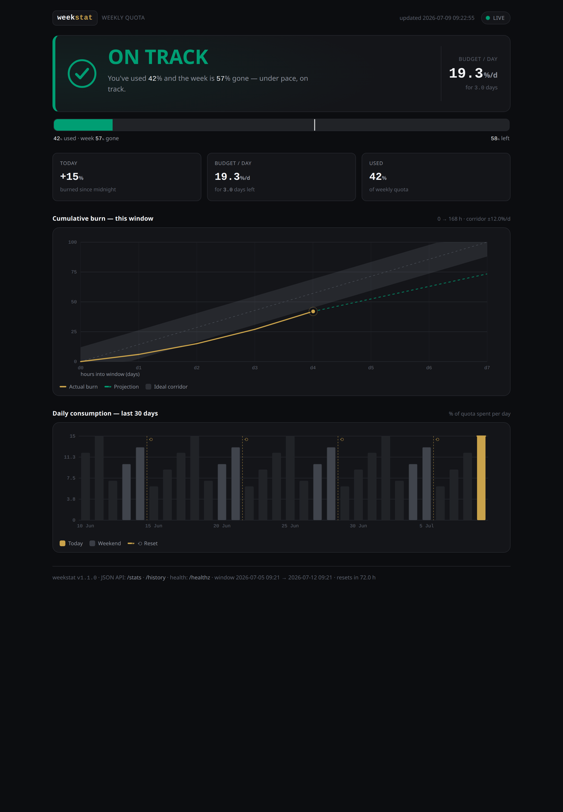

# weekstat

A tracker for the **Claude Code weekly quota** (the rolling 7-day
`rate_limits.seven_day`) with a live dashboard. A tiny Go daemon (stdlib only,
zero dependencies) that turns the instantaneous "how much quota is used" into a
useful picture of the week: how much you've spent today, how much you may spend
per day to make it last until the reset, and a per-day breakdown.

```
 wk: ██░░░░░░░░ left 77% · today 4% · budget 15.0%/day for 5.1d · on track ✓
```

- **left** — how much of the weekly quota remains;
- **today** — how much was burned during the current day;
- **budget X%/day** — how much you may spend per day to make the quota last until
  reset (recomputed live: overspending today automatically shrinks the budget for
  the remaining days);
- **pace** — on track / slightly over / over budget.

Plus an HTTP dashboard you can drop in on: **http://127.0.0.1:7457/**



---

## How it works

```
Claude Code ──stdin(JSON)──▶ statusline script
                                 │  ├─▶ draws the terminal line
                                 │  └─▶ dumps stdin to ~/.claude/.statusline-input.json
                                 ▼
                          weekstat (daemon)  ── watches the file, every 5s
                                 │
                                 ├─▶ ~/.claude/week-stats.json  ◀── statusline reads "today"
                                 └─▶ HTTP :7457  (dashboard + /stats + /history + /healthz)
```

Claude Code only exposes `rate_limits.seven_day.used_percentage` and `resets_at`
on the statusline's stdin — ephemeral data on every render. The daemon builds
history from it: it records used% at the start of each day and computes deltas,
tags every day with the window it belongs to, and keeps a rolling multi-window
daily history that feeds `/history` and the dashboard charts.

> Works only on subscription plans (Pro/Max) where Claude Code sends
> `rate_limits`. On a pure API plan that field is absent.

---

## Install

```bash
git clone https://github.com/butschster/weekstat.git
cd weekstat
./install.sh
```

`install.sh` builds the binary into `~/.claude/tools/weekstat/weekstat`, installs
a systemd `--user` service and starts it (boot autostart via linger).

Check:

```bash
systemctl --user status weekstat
curl -s http://127.0.0.1:7457/healthz     # -> ok
```

Prebuilt binaries are also on the [Releases](https://github.com/butschster/weekstat/releases) page.

---

## Wiring into Claude Code

Two steps: point the statusline at a script and add two integration lines to it.

### 1. Set statusLine in `~/.claude/settings.json`

```json
{
  "statusLine": {
    "type": "command",
    "command": "/home/USER/.claude/statusline-command.sh"
  }
}
```

A ready-to-use script lives in [`examples/statusline-command.sh`](examples/statusline-command.sh)
(it draws the directory, git branch, context bar and the weekly quota line). You
can copy it as-is:

```bash
cp examples/statusline-command.sh ~/.claude/statusline-command.sh
chmod +x ~/.claude/statusline-command.sh
```

### 2. Two integration points (if grafting into your own statusline)

**a) Feed stdin to the daemon** — right after reading the input:

```bash
input=$(cat)

_si="$HOME/.claude/.statusline-input.json"
printf '%s' "$input" > "$_si.tmp" && mv -f "$_si.tmp" "$_si"
```

**b) Show "today" from the daemon's output** — where you render the line:

```bash
today=$(jq -r '.today.spent_pct // empty' "$HOME/.claude/week-stats.json" 2>/dev/null)
[ -n "$today" ] && printf ' · today %.0f%%' "$today"
```

Everything else (left%, budget/day, pace) the statusline can compute itself
directly from `rate_limits.seven_day` on stdin — the daemon isn't required for
that; it's needed for "today", the per-day history and the dashboard. The example
in `examples/` does both.

---

## Dashboard & API

| URL | Returns |
|-----|---------|
| `GET /` | Live self-contained dashboard: hero verdict, evidence bar, cumulative-burn chart (vs. ideal corridor) and a 30-day consumption chart. Polls JSON and updates in place — no page reload. |
| `GET /stats` | Current snapshot as JSON (also written to `week-stats.json`) |
| `GET /history?days=N` | Daily time-series that feeds the charts (default 30, max 365) |
| `GET /healthz` | `ok` |

Example `/stats`:

```json
{
  "version": "v1.1.0",
  "window":  { "start": "2026-07-07 12:00", "end": "2026-07-14 12:00", "resets_in_hours": 123.5, "elapsed_pct": 26.5 },
  "quota":   { "used_pct": 23, "remaining_pct": 77, "budget_per_day_pct": 15, "days_left": 5.1, "pace": "on_track" },
  "today":   { "date": "2026-07-09", "start_used_pct": 23, "current_used_pct": 27, "spent_pct": 4, "spent_in_window_pct": 4, "budget_pct": 15, "left_pct": 11 },
  "days":    [ { "date": "2026-07-09", "spent_pct": 4, "share_pct": 100, "is_today": true } ]
}
```

---

## Top-panel indicator (Ubuntu / GNOME)

Read the numbers without opening a browser. A small companion app puts a
**ring-gauge icon in the top panel**. The ring has two modes (toggle from the
dropdown, remembered in `~/.claude/.weekstat-tray.json`):

- **Ring: weekly usage** (default) — the arc fills with used% of the weekly
  quota, coloured by pace (Okabe-Ito, colorblind-safe); the label shows used%.
- **Ring: today's budget** — the arc fills with today's spend as a share of the
  daily allowance; the label shows **how much % is left for today**, so one
  glance answers "can I keep going today?". Green while under 85% of the
  allowance, amber up to the limit, red when overspent.


*Left → right: on track (green), slightly over (amber), over budget (red).*

```bash
./install.sh --tray          # build + autostart the indicator
```

**Click it → dropdown** with the live figures (polled from `/stats` every 15s):

| Item | Example |
|------|---------|
| Pace verdict | `✓ on track` |
| Today | `Today: +2.0% of 12.8%  ·  10.8% left` |
| Today bar | `▕██▏░░░░░░░░░░░▏ 16% of day budget` |
| Week | `Week: 25% used  ·  75% left` |
| Week bar | `▕███▌░░░░░░░░░░▏ 25% of week` |
| Budget/day | `Budget/day: 12.8%/d  ·  5.1d left` |
| Resets | `Resets in 123 h` |
| Ring mode | `Ring: today's budget` / `Ring: weekly usage` (checkboxes) |
| Actions | `Open dashboard` · `Refresh now` · `Quit` |

The progress bars use eighth-block resolution and flag overspend with `⚠ over`
past 100% of the allowance. Flags: `--ring today|week` forces a mode on start
(and persists it), `--config` moves the preference file.

"Today" is measured against **today's own allowance** (the stable budget/day), so
you see at a glance whether you're within your slice for the day and how much of
it is left — without the future days' budget moving.

**Reopen after Quit:** the installer adds a launcher to the app menu, so search
“weekstat” in Activities. Or run it manually:
`~/.claude/tools/weekstat/weekstat-tray --addr 127.0.0.1:7457`.

**How it works / requirements.** It's a **separate Go module** (`tray/`) so the
daemon stays dependency-free — the tray needs a DBus StatusNotifierItem
(`fyne.io/systray`). It requires GNOME with the **AppIndicator** extension
(default on Ubuntu) and the Ayatana typelib:

```bash
sudo apt install gir1.2-ayatanaappindicator3-0.1   # if the icon doesn't appear
```

The ring icon is hand-drawn in Go (`image/png`) — no icon assets, no external
libraries. On Wayland the panel may also show the used% as a text label next to
the icon, depending on the shell.

---

## Pacing logic

- `left% = 100 − used%`
- `days_left = (resets_at − now) / 24h` (floored at 0.25)
- **`budget/day = left% / days_left`** — recomputed on every update, so overspending
  on one day automatically lowers the budget for the remaining days (and
  underspending raises it).
- **`today = used% − used%_at_day_start`** (the daemon keeps the baseline of the
  day's first reading).
- **pace** compares used% against the fraction of the window already elapsed:
  `on track` ≤ elapsed%, `slightly over` ≤ +10pp, otherwise `over budget`.

No dollars — everything is a percentage of the subscription quota.

**Reset day.** When the 7-day window resets mid-day, used% suddenly drops. The
daemon banks what the old window's part of the day spent (`carry_spent`) and
re-baselines the day at the new window's first reading, so:

- `today.spent_pct` stays the full calendar-day figure (old + new window);
- `today.spent_in_window_pct` counts only the new window's part — the daily
  budget and `left_pct` are measured against it, so the morning's pre-reset
  spend doesn't eat the fresh window's allowance;
- the daily budget is computed from the fresh baseline, not the stale
  pre-reset one.

---

## Configuration

Daemon flags (defaults shown):

```
--input     ~/.claude/.statusline-input.json   file to watch (stdin snapshot)
--out       ~/.claude/week-stats.json          where to write the stats
--state     ~/.claude/.weekstat-state.json     resume state file
--addr      127.0.0.1:7457                      HTTP dashboard address
--interval  5s                                   poll interval
```

Change the dashboard address at install time: `ADDR=127.0.0.1:9000 ./install.sh`.

---

## Managing the service

```bash
systemctl --user status weekstat
systemctl --user restart weekstat
systemctl --user stop weekstat
journalctl --user -u weekstat -f     # logs

# rebuild after code changes:
cd ~/.claude/tools/weekstat && go build -o weekstat . && systemctl --user restart weekstat
```

---

## Releases

GitHub Actions CI:

- **ci.yml** — `go vet` + `go build` on every push/PR;
- **release.yml** — on a `v*` tag, builds binaries (linux/darwin × amd64/arm64),
  writes `checksums.txt` and publishes a GitHub Release.

Cutting a new version:

```bash
git tag v1.0.0
git push origin v1.0.0
```

---

## License

MIT — see [LICENSE](LICENSE).
